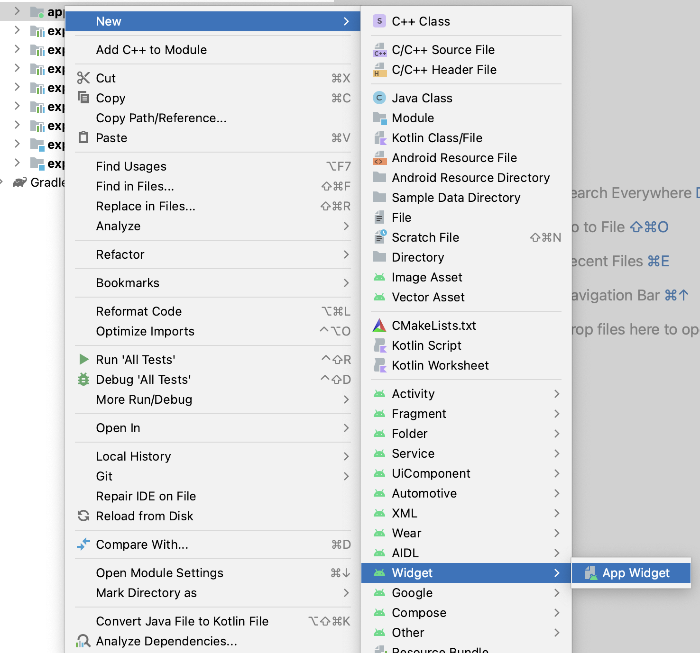
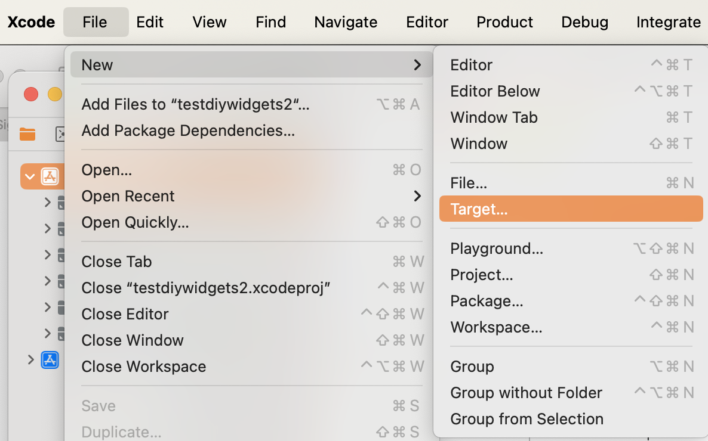
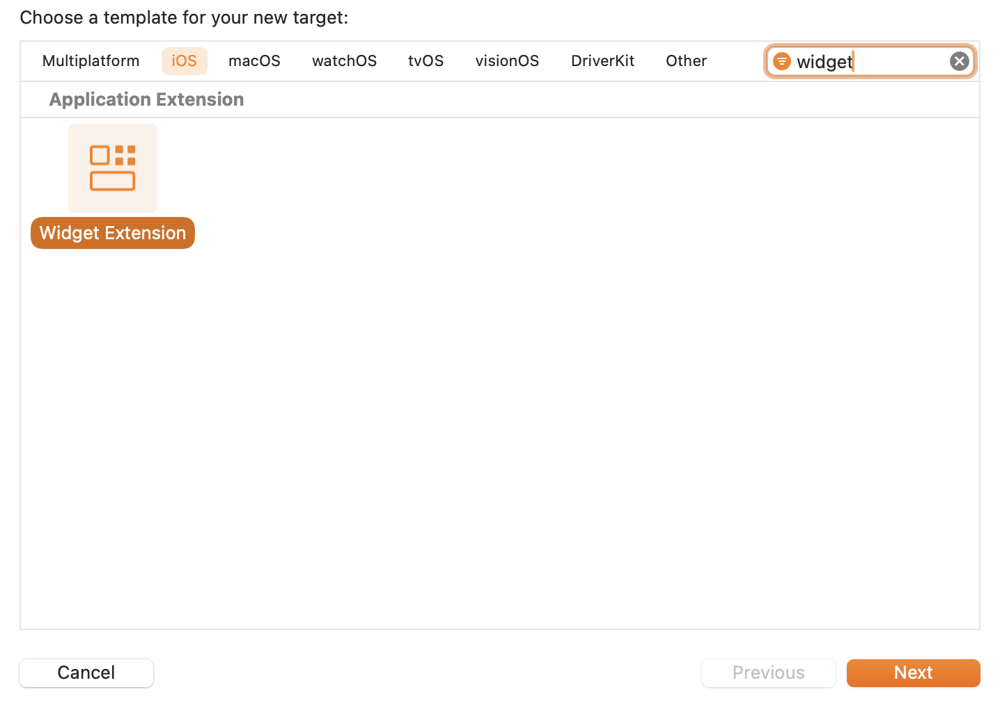
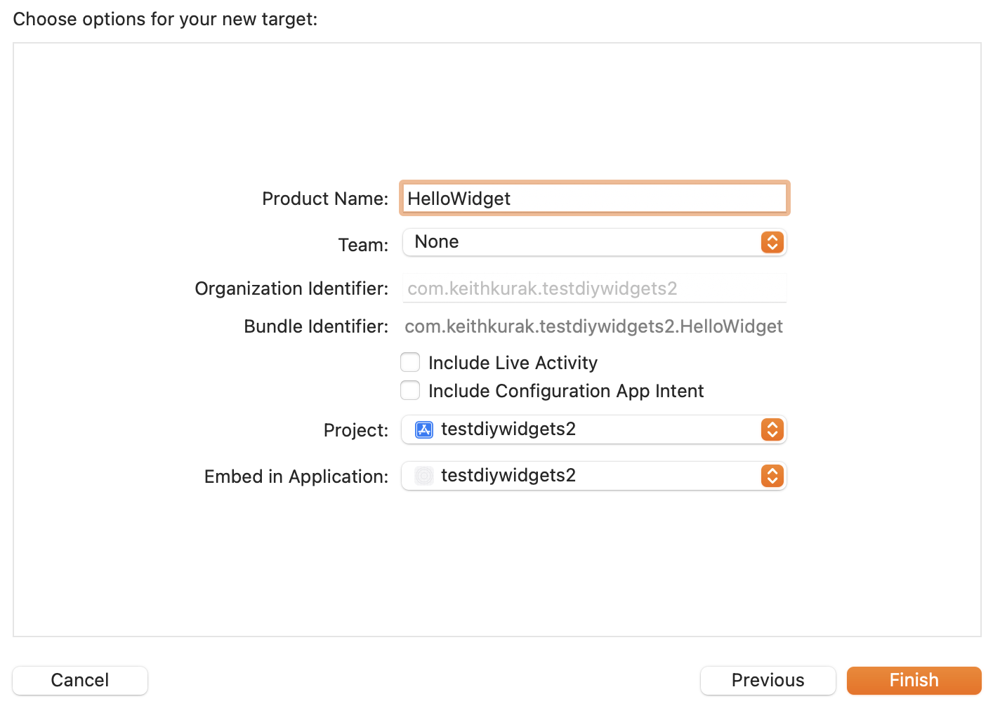
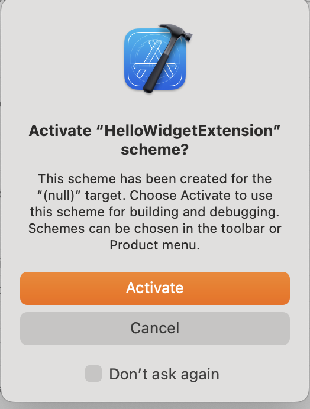

# Module 05: Build your own config plugins

### Goal

Let’s learn how config plugins modify native projects and let us tap into special native features by using one.

### Concepts

- Establish a good foundation for working with native features by walking through their configuration just like how any native develope would do it.
- Config plugins are just doing automatically what native guides tell you to do manually.

### Tasks

- Pick one platform to start (if you get done early, you can do the second one).
- Run Prebuild to generate the native project and walk through the configuration manually so you understand it. Save that work to a branch.
- Build a config plugin to create a basic “hello world” widget.

### Resources

- Link to any helpful docs.

# Exercises

## Exercise 1. Create an empty config plugin

> Before we break out into individual platforms, let's just make sure our plugin runs at all, even if it does nothing.

### Add the config plugin inside your project

1. Create a new top-level folder called **plugins**.

2. Add **withAndroidWidget.ts**:

```ts
import { ConfigPlugin, withDangerousMod } from "@expo/config-plugins";

const withAndroidWidget: ConfigPlugin = (config) => {
  return withDangerousMod(config, [
    "android",
    (dangerousConfig) => {
      console.log("Android widget!");
      return dangerousConfig;
    },
  ]);
};

export default withAndroidWidget;
```

3. Add **withIosWidget.ts**:

```ts
import { ConfigPlugin, withDangerousMod } from "@expo/config-plugins";

const withIosWidget: ConfigPlugin = (config) => {
  return withDangerousMod(config, [
    "ios",
    (dangerousConfig) => {
      console.log("iOS widget!");
      return dangerousConfig; // Return the modified config
    },
  ]);
};

export default withIosWidget;
```

2. Add a file called **withWidget.ts** that combines the two:

```ts
import { ConfigPlugin } from "@expo/config-plugins";
import withAndroidWidget from "./withAndroidWidget";
import withIosWidget from "./withIosWidget";

const withWidget: ConfigPlugin = (config) => {
  config = withAndroidWidget(config);
  return withIosWidget(config);
};

export default withWidget;
```

### Call the config plugin from your Expo config

1. Install `ts-node` by running `npm install --dev ts-node`. This will allow us to use TypeScript when running our app config (or anywhere else in Node, as opposed to Metro, where TS already works).
2. Change your **app.config.js** to **app.config.ts**.
3. Update **app.config.ts**:

```diff
+import 'ts-node/register';
+import { ExpoConfig } from 'expo/config';
- module.exports = ({ config }) => {
+module.exports = ({ config } : { config: ExpoConfig }) => {
  return {
```

<details>
  <summary>Expand to just get just the added code for easy copying</summary>

  ```ts
import 'ts-node/register';
import { ExpoConfig } from 'expo/config';

module.exports = ({ config } : { config: ExpoConfig }) => {
  ```

</details>

4. Add your custom plugin to the plugins array:

```ts
plugins: [
  // ...
  ["./plugins/withWidget.ts"],
];
```

🏃**Try it.** Run `npx expo prebuild --clean --no-install`. Do you see your console logs?

## Exercise 2. Choose Your Own Widget Adventure

You will now implement the config plugin that sets up a widget for either an iOS or an Android app- your choice. If you finish one of the platforms, you can come back to the other. You might not get to both platforms, and that's OK. Either one will teach you a lot about constructing config plugins.

**Android** - A good variety of editing configurations and adding resource files. Other than file copies, this is all using established mods. A good all-around choice that isn't too difficult and exposes you to a variety of things.

**iOS** - Widgets are much more complicated on iOS. Almost all of this config plugin involves editing the **xcodeproj** file in a dangerous mod. Less variety, but you will feel a lot more familiar with a very complicated concept by the end. Make no mistake; this is hard mode!

For each platform, you will do the following:

1. Perform the setup of the widget manually in Android Studio or Xcode, so you can understand what steps you will need to automate.
2. Write a config plugin to create the basic "Hello World" widget, comparing what your config plugin outputs to how the native projects when you created the widget manually.

Once you've chosen your platform, proceed to the next exercises, ignoring the steps specific to the platform you're not working on.

## Exercise 3. Add a Hello World widget to your app manually

### Setup your working branch

> We'll temporarily stop using CNG on a branch so we can examine our native projects more closely.

1. Create a new branch of your code. Remove the `ios` and `android` entries from your **.gitignore**.
2. Run `npx expo prebuild --clean` to generate fresh native projects.
3. Commit the projects to your branch.

### Android

#### (Not) creating a widget in Android Studio

**DON'T ACTUALLY DO THIS** This is only for demonstration purposes. If you were to use Android Studio for creating your widget, you would go here:



This wizard drops a million XML resource files on your disk. It's gross, and we don't want to replicate all of that. I think if you were really making a widget in Android native tools, you would use Jetpack Compose over XML layouts to avoid all of this (you'll find out in Module 06 that we'll use neither of these). What you need to know in terms of creating a config plugin is how to copy files, modify **AndroidManifest.xml**, and do a little **res** file tweaking. So, we will follow a simplified process focusing on these files.

The below instructions are inspired from the Android Studio wizard, but also from:

- [Android Documentation - creating a simple widget](https://developer.android.com/develop/ui/views/appwidgets)
- [Creating an Android Widget with Jetpack Compose / Glance](https://developer.android.com/develop/ui/compose/glance/create-app-widget)

#### Creating a Hello World Widget

1. In **android/app/src/main/res/xml** (create this folder if it doesn't exist), add **hello_app_widget_info.xml**:

```xml
<?xml version="1.0" encoding="utf-8"?>
<appwidget-provider xmlns:android="http://schemas.android.com/apk/res/android"
  android:description="@string/app_widget_description"
  android:initialKeyguardLayout="@layout/hello_app_widget"
  android:initialLayout="@layout/hello_app_widget"
  android:minWidth="40dp"
  android:minHeight="40dp"
  android:previewLayout="@layout/hello_app_widget"
  android:resizeMode="horizontal|vertical"
  android:targetCellWidth="2"
  android:targetCellHeight="1"
  android:updatePeriodMillis="86400000"
  android:widgetCategory="home_screen" />
```

(this defines the widget)

2. In **android/app/src/main/res/layout** (create the folder if it doesn't exist), add **hello_app_widget.xml**:

```xml
<RelativeLayout xmlns:android="http://schemas.android.com/apk/res/android"
  android:layout_width="match_parent"
  android:layout_height="match_parent"
  android:background="@color/cardview_light_background"
>
  <TextView
    android:id="@+id/appwidget_text"
    android:textColor="@color/cardview_dark_background"
    android:layout_width="wrap_content"
    android:layout_height="wrap_content"
    android:layout_centerHorizontal="true"
    android:layout_centerVertical="true"
    android:layout_margin="8dp"
    android:contentDescription="It's a widget I guess"
    android:text="original text"
    android:textSize="24sp"
    android:textStyle="bold|italic" />
</RelativeLayout>
```

(this defines how the widget looks)

3. In **android/app/src/main/res/values**, add the following to **strings.xml**:

```xml
<string name="app_widget_description">Hello, app widget!</string>
```

(a typical widget would involve a lot of resources, we're just adding one to demonstrate the config plugin mod for editing resources)

4. In **android/app/src/main/java/com/yourusernamehere/appjs24workflowsworkshopcode** add **HelloAppWidget.kt**:

> Make sure the package matches whatever is in your **MainActivity.kt**.

```kotlin
// update "yourusernamehere" to match your actual project namespace
package com.yourusernamehere.appjs24workflowsworkshopcode

import android.appwidget.AppWidgetManager
import android.appwidget.AppWidgetProvider
import android.content.Context
import android.widget.RemoteViews

class HelloAppWidget : AppWidgetProvider() {
    override fun onUpdate(
        context: Context,
        appWidgetManager: AppWidgetManager,
        appWidgetIds: IntArray
    ) {
        // There may be multiple widgets active, so update all of them
        for (appWidgetId in appWidgetIds) {
            updateAppWidget(context, appWidgetManager, appWidgetId)
        }
    }

    override fun onEnabled(context: Context) {
        // Enter relevant functionality for when the first widget is created
    }

    override fun onDisabled(context: Context) {
        // Enter relevant functionality for when the last widget is disabled
    }
}

internal fun updateAppWidget(
    context: Context,
    appWidgetManager: AppWidgetManager,
    appWidgetId: Int
) {
    val widgetText = "Some updated widget text"
    // Construct the RemoteViews object
    val views = RemoteViews(context.packageName, R.layout.hello_app_widget)
    views.setTextViewText(R.id.appwidget_text, widgetText)

    // Instruct the widget manager to update the widget
    appWidgetManager.updateAppWidget(appWidgetId, views)
}
```

(this binds app data to our widget)
**IMPORTANT**: Adjust that package name at the top if that changed in the course of building this app (compare with **MainApplication.kt**, these should match).

5. In **android/app/src/main**, add the following to **AndroidManifest.xml** inside `<application />`:

```xml
<receiver
    android:name=".HelloAppWidget"
    android:exported="false">
    <intent-filter>
      <action android:name="android.appwidget.action.APPWIDGET_UPDATE" />
    </intent-filter>

    <meta-data
      android:name="android.appwidget.provider"
      android:resource="@xml/hello_app_widget_info" />
</receiver>
```

(this binds the widget definition, data provider, and standard widget actions)

🏃**Try it.** Run `npx expo run:android` and try to add your widget.

#### Getting ready to make a config plugin

1. Commit this code. You'll use this in the next step to compare with the results of your config plugin.
2. Create a folder called **widgets/android**, and copy the following files there:

- **hello_app_widget_info.xml**
- **hello_app_widget.xml**
- **HelloAppWidget.kt**
  (our config plugin will later copy these files into the native project during prebuild)

### iOS

#### Creating the widget in Xcode

Open your **ios** folder in Xcode, go to File -> New -> Target..., and follow the wizard as shown below:




Name it "HelloWidget", don't select live activity or configuration intent:



Press Activate:



🏃**Try it.** Run `npx expo run:ios` on your simulator and try to add your widget. Annoyingly, on your simulator, the widget will not appear in the list until you enter a search (search "Art" and you'll see it).

#### Getting ready to make a config plugin

1. Commit this code. You'll use this in the next step to compare with the results of your config plugin.
2. Create a folder called **widgets/ios**, and copy the following files there (all in **ios/HelloWidget**):

- **HelloWidget.swift**
- **HelloWidgetBundle.swift**
- **Assets.xcassets** (copy the whole folder over)
- **Info.plist**
  (our config plugin will later copy these files into the native project during prebuild)

## Exercise 4. Create the config plugin

> Check out the recommendations for [comparing your plugin output to the intended native output](/companions/05/diffing-techniques.md). Use these techniques or something similar to check your progress as you create your plugin.

In the instructions below, we're going to focus on the raw code you'll be editing. It's up to you to decide when to pause and check your work using the techniques linked above or something else.

### Android

[Follow the instructions here for creating an Android plugin](/companions/05/android-plugin.md).

### iOS

[Follow the instructions here for creating an iOS plugin](/companions/05/io-plugin.md).

## Exercise 5: Clean up

1. Put `ios/*` and `android/*` back in your **.gitignore**.
2. Delete your native project folders.
3. Commit.

### Bonus

Have your config plugin accept a parameter or two. Add the `androidWidget` and `iosWidget` parameters to `withWidget`, pass the relative folders (e.g., `widgets/android` or `widgets/ios`) from **app.config.ts**, and use those to create your path constants instead of hardcoding them.

## See the solution

Switch to branch: `05-byo-config-plugins-solution`
